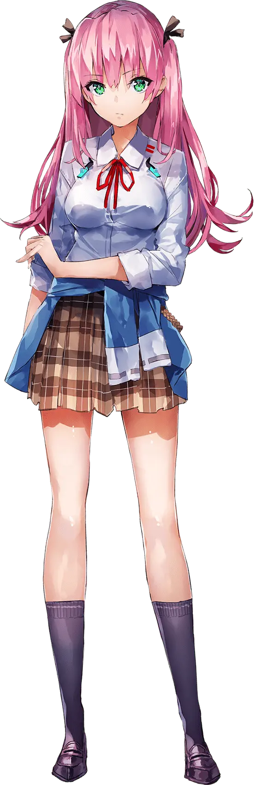
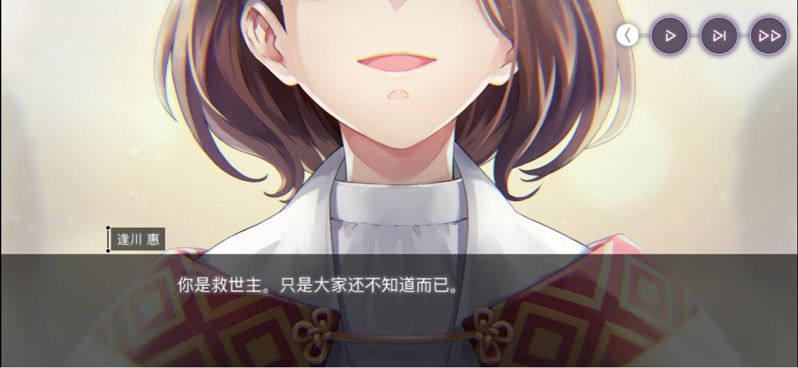
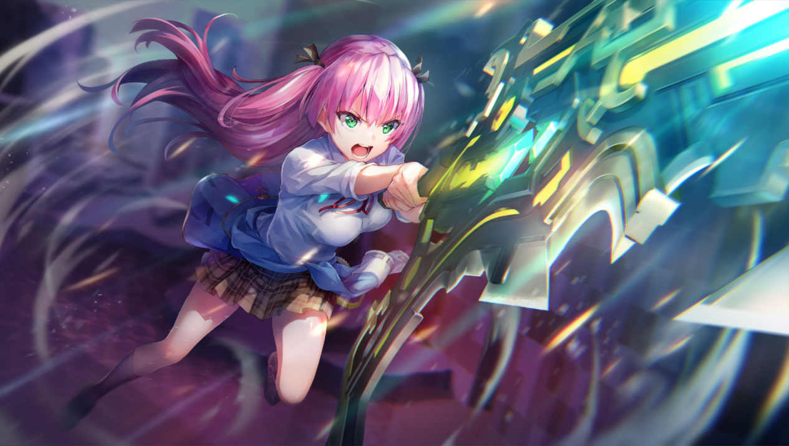
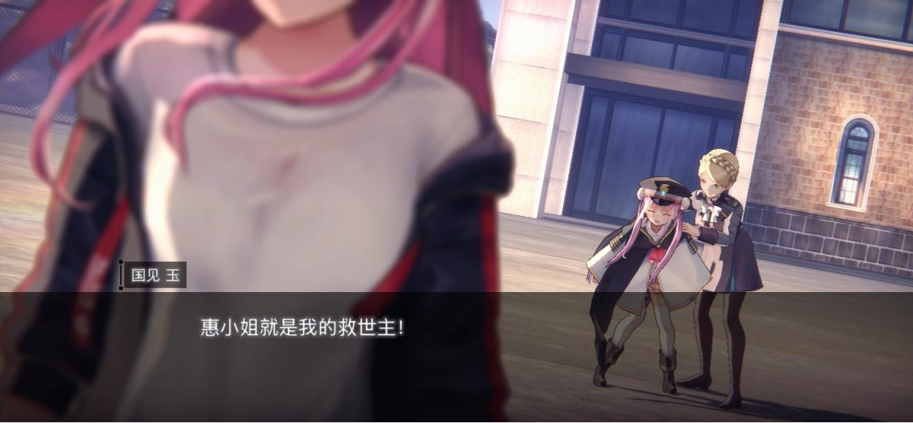
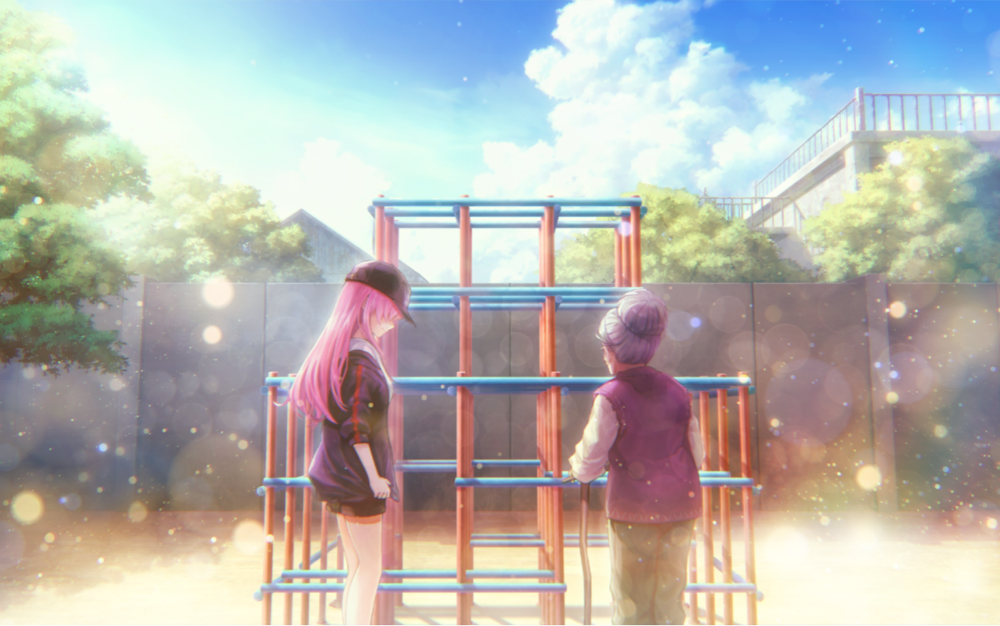

# 逢川惠传
前排提醒：本文涉及大量剧透，请在至少推完《Heaven Burns Red》第四章下篇及之前主线剧情后再观看本文。

叠甲：本文主要以主观评述，如有错误敬请指正。本文主要围绕人物展开，相关哲学理论的深度分析较少。

逢川惠，2012年10月28日出生于大阪，即关西出生，一口关西话也是其特征之一。据已知情报，人类逢川惠大概在据当前世界观29年前去世。成为人形纳比后，现在担任炽天使部队31A中担任队员，炽天使口令为“救世主大人登场（救世主様のお出ましや）”，同时兼任新生She is Legend的吉他手，在苍井绘里香担任吉他手时期，曾担任过噪音手。主要特征为关西腔，能够使用超能力，经常自称“救世主”，31A部队除和泉有希外的另一吐槽役，短暂担任过迫害役，经常关照队内的国见玉，二人关系甚密。

## 普通的少女

“这是一个关于逢川惠这家伙的故事，从小到大，这家伙就是自卑的代名词，她学习完全不行，与生俱来的虚弱体质导致她也不擅长运动。无论做什么都比别人差，她完全没有自信。在表达感情上……她也不擅长微笑。她一直是班级的边缘人物，被大家孤立。那时的她还是可以无忧无虑的年纪，但无能者往往都会对英雄有所向往吧？所以她无法容忍自己只是个自己只是个普通人。于是她就一个人尝试自己是否拥有特殊的能力。在尝试的时候……她成功让汤匙变弯了。”

在发现自己拥有拥有超能力的她，将使用超能力的视频发至网上，迅速走红，获得普遍的关注，被称为关西的天才灵能者，美少女灵能者……她为此高兴地忘乎所以。同一时期，关东出现了新的天才摇滚乐手——茅森月歌，当然这是后话。

终于有一天，真正的灵能者集团找到了她，她离家出走来到这个集团。集团里的人都是真正的超能力者，能够使用的超能力比她强过好几倍甚至几十倍。在集团里，她不再是那个受人关注的天才，反而因为不像样的能力而受到白眼，自卑感又一次开始折磨她。集团的领导者是一位颇有威严的预知能力拥有者，她预知到地球将要陷入的危机，于是建立起了这个由超能力者组成的拯救世界的组织。这样的领导者在人群的注视下走到她的面前，说了这样一句话：“你是救世主，只是大家还不知道而已。”

“咱会成为救世主。既然如此，那咱就成为给你们看。”她心想。自此，她怀抱着这句话，成为了救世主“逢川惠”。

## 妄自菲薄的天才超能力者

死后的逢川惠在29年后成为了人形纳比，与同样变成了人形纳比的茅森月歌分到了同一部队31A中。从第一章的开篇开始，逢川惠就对茅森月歌产生了强烈的竞争的意识，以一山不容二虎的姿态想要打败月歌。而站在月歌视角的玩家，自然也将惠树立成了假想敌，她在模拟训练中不断被迫害，在竞争中从未取胜，宛如小丑一般，就连原皮的SS风格也诞生出了“变大”的名梗。她狂妄、自大，以天才自居，以救世主自诩，一口关西腔咄咄逼人，吐槽起来以语速快著称，却是整个31A，甚至整个炽天使部队最普通的存在。

天才摇滚乐手，天才黑客，情报员，杀人魔，原舰长，31A的队友过去的身份都绝非“普通”。而逢川惠唯一的长处仅有那看起来毫无用处的超能力，只能自称为灵能者。在天才扎堆的炽天使部队里，她也只是个“努力的天才”。闲暇时刻，她会通过冥想，与高我对话，以此来修炼自己的超能力。她无比在乎自己的身份，当月歌想和她一起修炼超能力时，她严词拒绝，以灵能者有她一人即可的理由排斥月歌。

主线剧情前三章，主要在展开世界观，较于一直活跃的月雪，第三章的关键先生司和不断找存在感的可镰，惠玉二人组显的像是队内的吉祥物，当日常剧情需要时活跃一下气氛，否则就保持隐身，能给人留下的印象就只有“喂，TaMa！”和舞台上的噪声。

无论你对逢川惠这个角色在前三章持怎样的态度，抱怎样的看法，她强势的面具都将在第四章被揭开，你的态度与看法也将随之改变。

## 自诩救世主的胆小鬼

身而为人，最重要的是什么？

见证了藏里见“死亡”的31A队员，不得不面对眼前这个残酷的事实：你所拥有的全部十几年的记忆都不是你的，你只是拷贝了这个人的DNA，是伪物，是赝品，并非人类的你，被人类造了出来，却还要为了人类而战斗。

31A不同的人面对这样的事实也做出了不同的回应。

东城司在生前就算到了这样的现实，自然能够接受。国见玉生来就是战争机器，对生命和死亡的意味并没有深刻的理解，对生而为人的实感不足，这样的现实反而成为了她回忆主计算机的契机。朝仓可怜……。和泉有希凭借自己冷静、理智的头脑迫使自己淡然接受。

真正世界观遭到崩塌的，只剩下茅森月歌与逢川惠。茅森月歌在白河由依奈的开导和和泉有希的陪伴下从自闭中走了出来，选择相信现在，为了确实存在在这里的伙伴们而战。逢川惠则在崩溃的路上越走越远。她陷入了自我存在的虚无主义中，找不到存在的意义，意识不到活着的实感，一切都是空洞，一切皆是虚无。

陷入虚无主义的逢川惠，在第四章上篇覆地之手的讨伐战中开始了自己的摆烂之旅。面对来自国见玉的开导与关心，她以更加锐利的语言进行回击；作战途中情绪化不听指挥，差点导致31A团灭；甚至在藏里见的葬礼上当着30G的面大放厥词。过激的言辞与行为使得多数玩家对于逢川惠的好感在这一篇中一降再降，即使再能和她产生共鸣，也不免对她感到失望。“救世主”？“英雄”？放在她的身上一切都是那么的讽刺。

在一次过激行动——对国见玉使用了超能力之后，罪恶感迫使逢川惠冷静了下来，终于面对曾与自己同样对现实感到绝望的茅森月歌，惠道出了人类逢川惠的记忆。玩家终于能够逐渐走近惠的内心，揭下她的面具，重新认识这个心思细腻的女孩。

“本小姐是救世主，只是大家还不知道而已……多亏那句话的支持，本小姐才能战斗到现在。”自卑，是逢川惠人生的主旋律，不甘于做普通人，不断的努力却只能达到普通。普通，与英雄相悖，却是与玩家产生共鸣的桥梁。不断的自我否定，是懦弱内心的体现，以救世主自诩，是支撑起懦弱内心的表现。当月歌问到：“你是不是逢川惠本人就这么重要吗？”她毫不犹豫地回答：“当然重要了，咱的存在意义全在于此。”她无数次想要倾诉，但整个炽天使部队又有谁能懂她？来自伙伴们关心的话语即是一味良药治愈她的灵魂，又是一把利刃刺穿内心的空洞。

时间仿佛真的能治愈伤痛一般，惠尝试相信月歌一次，领导者所说的救世主并非人类逢川惠，而是如今的人形纳比逢川惠。她顶着几近崩溃的情绪，重新以自己的意志踏上战场这次她要为保护同伴而战。但是命运的嘲弄依然没有结束，覆地之手讨伐战中惠的超能力成为限制覆地之手行动的关键因素——她将成为本次战役的救世主。在最不好的状态下遇到了最好的机会，这就像一场赌博，赢则成为真正的救世主，输则成为压垮骆驼的最后一根稻草。结果以无人阵亡的胜利结束，但就在31A和玩家们期待着迎来第四章上篇的HappyEnding的时候，惠却突然选择了退役。

伴随着《贅沢な感情》响起，玩家们随着月歌的视角见证了惠的不辞而别。

### [贅沢な感情](https://music.163.com/song?id=1995455813&uct2=U2FsdGVkX1/0UcKbyk0YcB3Owb8+/SuOoS7pMhH8zOY=)
---  
Don't be afraid.  

不要害怕。

眩しい陽が差す通りで　君を待つ

我就在那阳光铺陈的大道上等你

胸を高鳴らせた

曾经每天是多么欢欣雀跃

そんな日も　遠く

而那般日子也已远去

君に恋してたんだ

与你坠入爱河

だが忘れそうだった

内心的悸动却渐渐模糊不清

残酷なことに翻弄されても

就算被残酷的现实所愚弄

進むことやめちゃダメだよね

也不能停下前进的脚步吧

それなのにこんな失ってばかり

尽管如此 一路上仍旧不断失去

笑ってたい　それは贅沢だ

多想笑一笑啊 但这是何等奢侈的感情

分かってる

我心知肚明

--- 

*－“……”*

*－惠惠，你为什么要突然离开啊！*

*－因为咱已经无法和你们一起战斗了。*

*－唉？*

*－为什么啊？！*

*－月歌，咱曾试过相信你说的话……*

*－那位先知领导人的话，并不是对人类逢川惠说的，而是对现在的咱说的……也就是说她想把那句话告诉身为人形纳比的逢川惠。昨天的作战就对这句话进行了验证……结果如何？简直是惨不忍睹……支撑着咱的东西已经消失殆尽了……战斗的意义、理由、自信、存在的意义……全部。咱不是救世主，只是一个纳比呀……*

*－可你不是打倒了覆地之手吗！*

--- 

Don't be scared.

无需恐惧。

優しい風が君の髪　膨らませた

轻柔的微风吹拂着你的长发

ずっとそばにいると　誓ってよ

在此发誓吧 说你会一直待在我身旁

いつまでも　じゃれ合おう

会永远与我一同玩笑嬉闹

つまらない夢も　語り合った

过去也曾畅聊过 各自的平凡梦想

地獄は続くけど

尽管地狱从未消失

傷つき傷つけ　それでも生きる

就算不得不互相伤害 也要苟活下去

人間って　そういうものだから

人类就是这样的生物

それでも　時には死にたくもなるよ

但身而为人 有时也会想放弃生命

難しいことばかりなんだ

人是多么复杂难解啊

分かってる

我心知肚明

--- 

*－没错！！31A今后也需要惠小姐！！*

*－别说傻话了！！*

*－咱不是害你们身陷险境了吗！！你们要咱以这种状态继续站在战场是吗！像昨天那样让你们陷入危险之中！！咱早晚会害死你们的！！*

*－……*

*－咱曾经也看到过一丝光明……还以为……只要承担起了这份责任，就能满怀身为救世主的自信去战斗……可是，已经不行了啊……已经撑不住了……咱的能力不够……咱并不是救世主啊……所以，咱已经没有继续战斗的意义了……*

*－才不是这样……惠小姐……*

*－可恶……咱好想保护大家啊……好想成为救世主啊……可是咱没能做到……*

*－就因为失败了一次……*

--- 

もう世界中が敵になって

假如全世界都变成了敌人

あたしに襲い来る

一齐向我袭来

悪夢でも朝になって消え去るならいい

要是噩梦到了早上就会自然消失该多好

目覚めても続いてくこの夢はなんだろう

醒来后依然无法摆脱的这场梦究竟算什么呢

神様も眠ったままだ

只是因为神也还在睡梦中啊

眩しい日差しに君が消えてく

耀眼日辉下 你渐行渐远

その日々に何の意味がある

与你度过的时光究竟有何意义

諦めきれずに何度も呼ぶけど

我不愿放弃 无数次呼喊你的名字

もう声は届かない

但声音已无法传达

残酷なことに振り回されても

就算被残酷的现实肆意摆布

新しい朝に目覚めなきゃ

但到了新的清晨也必须睁眼面对

分かってる

我心知肚明

--- 

*－咱说过这是一丝光明吧……现在咱已经什么都看不到了……眼前一片漆黑……昨天咱和司令官也说过了，如果无法凭自己的力量保护你们，那咱就退出……所以啊……要在这儿和你们拜拜了。*

*－惠小姐……即便如此！即使惠小姐是这样看待自己的！可我来到这里以后，还是第一次有了生而为人的感觉！我之前的人生一直都在被他人依靠，生命里只有战斗。可在这里我得到了安宁！所以……* ***惠小姐就是我的救世主！***

*－这样啊……那就由玉你来接着做人类的救世主吧。拜拜啦……*

---

惠的赌注从一开始就不是打败覆地之手，她想做的是保护她所持有的“现在”，保护真实存在的同伴。所以当她因为自己的弱小而导致同伴身陷险境时，她就已经输了，她无法忍受弱小的自己，无法忍受自己是个连同伴也守护不了的胆小鬼，这样的根本不是救世主。她早已做好了失败后就退出的准备，当曾经支撑着自己的东西突然变成了一种沉重的包袱压在自己身上时，她再也坚持不下去了……

惠的人设此时已经压抑到了极点，对惠的一切不满，一切同情，在此刻呼之欲出。为什么其他人都能做到，就你不行？一味地偏执于救世主的身份，最终却成了逃兵。难道你的故事真的要以这样的遗憾收尾吗。普通之人，倾尽自己的一生，却只配得到这样的结局吗？

## 爱哭的小女孩

救世主逢川惠再一次死亡，留下来了一个新的名字——加藤惠理。

退役后的逢川惠来到习志野避难所，开始了加藤惠理漫长的平民生活。这里不再有如何拯救世界的宏大叙事，只剩下平平淡淡的平民日常生活。加藤惠理每天探索废墟，钓钓鱼，帮助居民，就连能直接杀死星癌体的超能力，也被用来给电瓶车充电。在日复一日、朴素如歌的生命节律中，逢川惠逐渐地疗愈着自己的内心世界。避难所里没有炽天使部队里每天大鱼大肉般的奢靡生活，只有一顿接一顿的粗茶淡饭，没有遍地的天才，只有与自己一样，甚至不如自己的普通人。她不再为自己的弱小而自卑，也不再为自己套上空虚的救世主枷锁，为居民们尽自己所能，用力活着的日常所打动，真心实意地享受起了生活。

在体会过平民的生活，见过活生生的人之后，惠找到了自己存在的意义，她不用拼了命地思考身为纳比的她战斗有什么意义，她就是她自己，她就是“加藤惠理”——星癌体驱逐大师。当面对星癌体的入侵之时，她产生了想要保护避难所居民的想法，她意识到这个愿望不属于其他任何人，是独属于自己的愿望。自此，逢川惠迎来重生。当世界上有人需要拯救的时候，她会再次高喊“救世主大人登场”，但内涵已完全不同，她不是因为预言所以要成为救世主，而是因为自己所做的，就是拯救世界。所以她的回归一切都是那么自然，她不需要过多的理由，仅仅是因为那里需要自己，仅仅是因为她就是“逢川惠”，与同伴一起战斗，拯救人类，这就是她最纯粹的欲望。

即使是手冢特意的安排，但又仿佛一切都是命运的偶然，加藤惠理在避难所里遇到了逢川惠的母亲，而母亲已经等了逢川惠29年。在即将回归炽天使部队之时，她与为来得及相认的“母亲”告别。

### [夏気球](https://music.163.com/song?id=1997152503&uct2=U2FsdGVkX19M/NrtlOYciTYe/exmSoPDLttW1wGUgVs=)

--- 
日差しは容赦なく

阳光真是无情啊

まぶた越しに届いた

闭上眼睛都能看到

政治もわからないのに

看不懂政治的我

新聞を待つ朝

在早晨等待报纸送来

--- 

*-秋婆婆，咱决定要走了。*

*-……*

*-抱歉，咱骗了你。咱其实是炽天使部队的队员，现在要归队了。*

*-……*

---

あの夏は彼方に

那个遥远的夏天

声は届くだろうか

声音能够传递到吗

消えないでほしいから

祈祷着不要消失

ずっとずっとって言うよ

我一直 一直 闭上眼这么默念

--- 

*-秋婆婆，你在这里干啥呢？*

*-咱在等人。*

*-你总是背着的那个行李，原来是这个组合式的攀爬架啊。*

*-有问题吗？*

*-别摆出这份蛮横的态度啊。*

*-哼，所以说年轻人啊。*

*-咱是在担心你这么才说的。*

*-别管咱。等自己的女儿有啥不行的。身为母亲，自然会这样做的吧。*

*-她已经不在了。*

--- 

背中を小突くのは

后背似乎被戳到了

母のかける掃除機

是母亲的吸尘器

夢もわからないのに

这是不是梦呢

作文を書く午後

这个写着作文的午后

あの夏が彼方に

那个遥远的夏天

二度と戻れないのに

明明再也回不去了

行かないでほしいから

祈祷着你不要走

ずっとずっとって言うよ

我闭上眼一直 一直 这么默念

--- 

*-别随便说她不在了！！咱的女儿……说不定现在还活着，正在鲁莽地对抗着星癌体呢。说不定每次都打不过，每次都输掉……然后在哪里嚎啕大哭呢……说不定正孤零零的呢……因为咱不在她的身边。要是咱在她身边，就可以陪她一起玩了……就算她哭着回去，只要咱叫她一起玩，她就会马上精神起来，投入到游戏中去……她就是这样的孩子。所以咱必须等她。*

---

もっとそばで見ててよ

再多看一眼吧

あれもこれも出来るんだ

无论这个那个都可以

活字苦手も直り

不擅长的字也变得能写好了

少女は大人になった

少女已经变成大人了

--- 

*（咱知道……咱还记得……咱确实有这些记忆……已经足够了……咱记得你经常陪咱玩……也记得你把大哭的咱带回家……还记得你给咱做了许多好吃的饭菜……咱也知道你是把瑠未当成亲生孩子来养的……所以啊……）*

*-唯有瑠未，你要照看好她，千万不要忘记她啊。*

*-咱咋会忘记她啊。*

*-真的吗？那咱们一言为定。*

*-咱对自己的记忆力有信心，咱还没老到那个份上呢。*

*（是啊……咱记忆里的老妈对别人也很强势……那时她还很有活力……而现在已经老成这样了……咱就是她的女儿啊……她明明忘记了避难所居民们的样子，却唯独没有忘记咱和瑠未……是因为她和瑠未一起生活，已经把瑠未当成了自己的孩子……而咱是她真正的女儿啊……咱很想告诉她，但是说不出口……自那之后已经过了二十九年……告诉她的话，她会把咱当成怪物的……）*

--- 
あの夏は彼方に

那个遥远的夏天

まだ遊び足りなくて

还没有玩够啊

眠りたくないから

真不想睡着啊

待って待って駄々こねてばかり

一直 一直耍赖地等着

あの夏よ彼方へ

那个遥远的夏天啊

まだそこで待ってるなら

如果还在那里等着的话

ずっと消えないでほしいから

我希望你永远不要消失

言うよ ずっと居てって

我在原地等着 自言自语

--- 
*-有件事想拜托你。*

*-啥事？*

*-既然你是炽天使部队队员，那就有机会寻找在某个地方嚎啕大哭的孩子吧？找到的话可以帮咱给她带几句话吗？*

*-啥话？*

*-告诉她，她老妈在等她。还会像以前那样陪她一起玩。玩起来她就不会哭了……还会给她做好吃的饭菜……还有啥来着……就告诉她，* ***咱会等她的……会永远等着她的……***

*******-嗯……咱会转告她的……*

*（已经传达到了……）*

*-全都会转告她的……*

*（全都传达到了……）*

*-咱在这两周的时间里，已经充分了解秋婆婆了……已经用不着担心了……咱会一字不漏地转告她的……咱一定会找到她，然后转告她的……所以你别担心……交给咱吧……*

*-是吗……* ***那咱就放心了。***

--- 

あの夏は彼方に

那个遥远的夏天

古い作文のように

就像一篇老作文一样

--- 

爱哭的小女孩跨越29年时空，等来了自己迟来的拥抱，修复破碎内心的是名为“母亲”的港湾，名为“家人”的温床，驱使着她战斗的是名为“同伴”的支架，名为“英雄”的呼唤。加藤惠理终于接受了弱小的自己，也接受了自己就是逢川惠的事实，以自己的意志踏上了战场。

归队后的逢川惠与31A其他人一同战胜了亡骨之翎，接受了国见玉的深情告白，再度响起的《贅沢な感情》呼应四上的告别。当然这里主要是国见玉的回合，不再赘述。

自此，逢川惠回归31A，其人设与故事已基本完整，后续剧情中基本担任工具，剧情中伏笔待后续回收。活动剧情《支配泳装者方能支配夏天》主要讲述宏观叙述下小人物的取舍，以及相关命运论和平行世界的描写，可作为惠玉二人的额外剧情和相关设定的补充。

## 后话

这是我第一次写传记类文章，因为恰好有这个机会，所以就写了，写得好烂，还请见谅。

逢川惠这个角色在第四章之前都是31A中在我看来最不讨喜的角色，而第四章，是我第一次因为主线剧情而哭了出来，在我心中已经是毫无疑问的神作 ~~（没想到五上哭的更彻底）~~。至今我对逢川惠都是又爱又恨的存在，我讨厌她如此的真实，看到她仿佛是对自我的审视，喜欢她是因为她的人设丰满讨喜，第四章的剧情又是封神的存在。麻枝准的剧本特色其中之一就是关于与过去和解，第一个传记就选择她，也确实是因为就目前来看惠玉的关于过去的剧情已经基本宣告完结，而且相比于玉，惠的剧情能够让我更有共鸣，印象点更深，而且剧情量也不算大。

说个题外话，我的账号真的超喜欢歪惠的，惠的薄暮时分·飞升（西装惠）是我目前唯一一个除月歌闪光的电气脉冲（梦幻泡影）外第一个lv4的风格，而且全是歪出来的，同时也是我第一个称号达Rank 5拥有大师技的角色。

- 2025年11月7日投稿于 厦门大学翔安静迹动漫社社刊《长厦静迹》